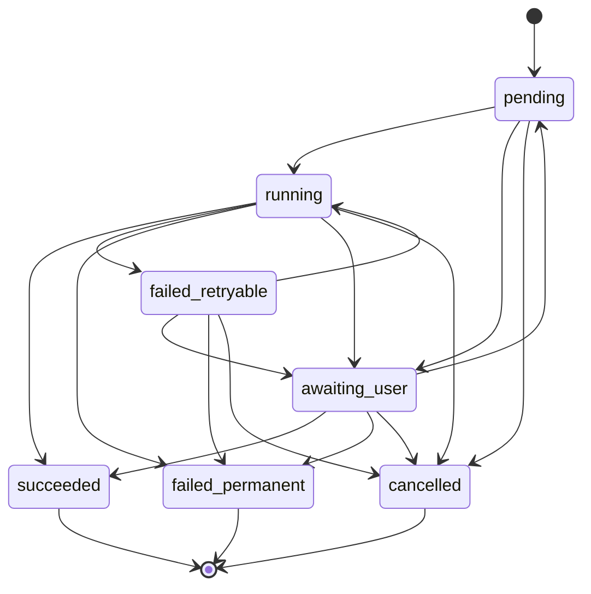

# Arquitectura objetivo local

Este documento es la propuesta de arquitectura vigente.

La aplicación objetivo es una aplicación Windows nativa escrita íntegramente en
.NET. No depende de Python, WSL, OBS, FFmpeg, un navegador, un backend propio ni
una base de datos remota.

Las primeras versiones mantienen todo el corpus en el equipo del usuario:

- SQLite guarda estado, metadatos y proyecciones consultables;
- el filesystem guarda audio y artefactos grandes o inmutables;
- Windows Credential Manager guarda credenciales;
- Deepgram es el servicio externo de transcripción;
- Claude Code headless puede usarse opcionalmente para generar summaries con la
  cuenta y los créditos incluidos del usuario, sin integrar directamente una API
  key de LLM.

En este documento, **local** significa que no existe almacenamiento, autoridad ni
servicio de aplicación en la nube. Deepgram y, si se habilita, Claude Code siguen
procesando datos fuera de la aplicación y requieren consentimiento explícito del
usuario.

El objetivo no es solamente transcribir. Es convertir reuniones en conocimiento
local, consultable y verificable por personas y agentes LLM.

---

## 1. Decisiones

### 1.1 Aplicación Windows nativa y autocontenida

**Stack recomendado: .NET 10 LTS, C#, WinUI 3 y Windows App SDK.**

La aplicación se implementa de nuevo en .NET. El código Python actual sirve como
referencia funcional y como fuente de fixtures, pero no forma parte del runtime,
del instalador ni del flujo de usuario de la nueva aplicación.

La aplicación es responsable de:

- capturar micrófono y audio de la reunión;
- alinear ambos flujos sobre una timeline común;
- mostrar niveles, fuente y errores durante la grabación;
- escribir un spool recuperable;
- validar el audio y estimar el coste antes de transcribir;
- llamar a Deepgram con una clave del usuario;
- conservar `deepgram.json` como artefacto pagado e inmutable;
- renderizar transcript, turnos y proyecciones sin herramientas externas;
- generar summaries mediante proveedores intercambiables;
- mantener una cola local durable;
- buscar, consultar y editar reuniones;
- exportar y restaurar backups manuales.

No se requiere FFmpeg. El primer formato de intercambio será WAV PCM lineal de
16 bits, 16 kHz y dos canales. Es más grande que FLAC, pero elimina una dependencia
y reduce el riesgo del MVP. La compresión se añadirá únicamente si el tamaño o el
tiempo de subida medidos lo justifican.

### 1.2 Persistencia exclusivamente local

SQLite es la única base de datos de la aplicación. No hay PostgreSQL, Supabase,
object storage, API remota ni sincronización entre máquinas.

SQLite contiene datos pequeños y consultables. El filesystem contiene audio,
respuestas originales y derivados grandes. Los blobs no se guardan dentro de la
base de datos.

Este reparto permite:

- transacciones y constraints para el estado local;
- Full Text Search con FTS5;
- inspeccionar y copiar los artefactos sin herramientas especiales;
- reconstruir la base consultable desde las fuentes guardadas;
- crear backups consistentes sin diseñar todavía un sistema distribuido.

### 1.3 Proveedores externos explícitos

Deepgram es una integración necesaria para la transcripción, no parte de la
persistencia de la aplicación. La clave es BYOK y se guarda en Windows Credential
Manager.

El summary puede operar en tres modos:

- **Claude Code headless:** usa la instalación y autenticación del usuario;
- **API BYOK:** adaptador futuro para un proveedor LLM con clave propia;
- **manual/desactivado:** la reunión puede existir y buscarse sin summary.

La ausencia de Claude Code nunca bloquea grabación, transcripción, renderizado,
búsqueda ni recuperación.

### 1.4 Acceso local para agentes

La primera interfaz para agentes será un servidor MCP local por `stdio`, escrito
en .NET y separado de la GUI. No abre un puerto, no expone SQLite a la red y no
requiere un backend.

El proceso MCP usa los permisos del usuario de Windows y ofrece herramientas de
dominio limitadas. No entrega acceso SQL arbitrario ni rutas internas salvo cuando
una operación de lectura lo necesita.

### 1.5 Sin arquitectura cloud anticipada

No se diseñan tablas, APIs ni jobs para una nube hipotética. Si más adelante se
necesita backup remoto, la primera solución será unidireccional:

```text
snapshot local verificado -> destino remoto -> restauración manual
```

Ese backup será una copia opaca y versionada del corpus, no sincronización, edición
remota ni una segunda fuente de verdad.

---

## 2. Vista general

```text
┌──────────────────── APP WINDOWS — .NET / WINUI ────────────────────┐
│ captura WASAPI · timeline · medidores · recuperación · búsqueda     │
│ cola durable · Deepgram BYOK · summaries · edición local            │
└───────────────┬───────────────────────┬──────────────────────────────┘
                │                       │
                ▼                       ▼
       ┌─────────────────┐     ┌──────────────────────────────────┐
       │ SQLITE          │     │ FILESYSTEM LOCAL                 │
       │ reuniones       │     │ spool y audio                    │
       │ jobs y estados  │     │ deepgram.json                    │
       │ turnos          │     │ extraction.json                  │
       │ summaries       │     │ transcript.md y derivados        │
       │ decisiones      │     │ snapshots de backup              │
       │ acciones + FTS5 │     └──────────────────────────────────┘
       └────────┬────────┘
                │
                ▼
       ┌─────────────────┐
       │ MCP LOCAL .NET  │
       │ stdio/read-only │
       └─────────────────┘

Integraciones explícitas:

App ──HTTPS──► Deepgram
App ──proceso local opcional──► Claude Code headless
```

---

## 3. Estructura de la solución .NET

La UI no contiene reglas de negocio. La solución se divide por responsabilidades:

```text
MeetingTranscriber.sln
  src/
    MeetingTranscriber.App/             WinUI, navegación y composición
    MeetingTranscriber.Domain/          entidades, estados y reglas puras
    MeetingTranscriber.Audio/           WASAPI, timeline, spool y niveles
    MeetingTranscriber.Infrastructure/  SQLite, filesystem y credenciales
    MeetingTranscriber.Processing/      Deepgram, transcript y summaries
    MeetingTranscriber.Mcp/             servidor MCP local por stdio
    MeetingTranscriber.Cli/             diagnóstico, reparación y automatización
  tests/
    MeetingTranscriber.Domain.Tests/
    MeetingTranscriber.Audio.Tests/
    MeetingTranscriber.Infrastructure.Tests/
    MeetingTranscriber.Processing.Tests/
    MeetingTranscriber.App.Tests/
```

Las dependencias apuntan hacia el dominio. WinUI, SQLite, WASAPI, Deepgram y Claude
Code son adaptadores reemplazables alrededor de reglas comprobables sin hardware
ni red.

La CLI comparte los mismos servicios de aplicación que WinUI. No implementa un
segundo pipeline. Sirve para diagnóstico, importación, rebuild y recuperación,
además de permitir tests del flujo completo sin automatizar la interfaz gráfica.

---

## 4. Corpus local

### 4.1 Ubicación

El corpus vive por defecto bajo una carpeta de datos del usuario, configurable
desde la UI. No vive dentro del directorio de instalación ni en la carpeta de
datos del paquete MSIX: esa carpeta se borra al desinstalar y el corpus contiene
artefactos pagados que no se pueden volver a obtener.

```text
MeetingTranscriber/
  corpus.db
  meetings/
    <meeting_id>/
      manifest.json
      audio.wav
      deepgram.json
      transcript.md
      utterances.jsonl
      extractions/
        <extraction_id>.json
      summary.md
  spool/
    <meeting_id>/
      manifest.json
      others.blocks
      microphone.blocks
  backups/
  logs/
```

`manifest.json` no sustituye SQLite. Es una ficha mínima de recuperación que
permite reconocer los artefactos si la base está dañada o ausente.

### 4.2 Fuentes y derivados

Fuentes que no se sobrescriben:

- bloques originales del spool mientras sean la única copia recuperable;
- `audio.wav`, si la política local del usuario decide conservarlo;
- `deepgram.json` recibido de la transcripción pagada;
- cada extracción aceptada bajo su propio `extraction_id`;
- clasificación, nombres y correcciones aprobados por una persona;
- el estado y el responsable de cada acción, que los mueve una persona.

Derivados reconstruibles:

- `transcript.md`;
- `utterances.jsonl`;
- `summary.md`;
- tablas de utterances, summaries, decisiones y acciones;
- índices FTS5.

Una acción reconstruida vuelve tal como la propuso la extracción. Su estado y su
responsable no están en esa fila: viven en `action_item_progress`, apuntados a la
extracción y a la posición dentro de ella, y no al id de la acción, que la
reproyección vuelve a generar.

Un rerender nunca modifica `deepgram.json` ni una extracción anterior. Una nueva
extracción crea una versión nueva y conserva la anterior.

### 4.3 Escrituras durables

Los artefactos importantes se escriben así:

1. escribir un fichero temporal en el mismo volumen;
2. vaciar buffers y cerrar;
3. calcular tamaño y SHA-256;
4. validar que el contenido puede releerse;
5. reemplazar atómicamente el destino;
6. registrar el artefacto confirmado en una transacción SQLite.

Al iniciar, un reconciliador examina temporales, spools y ficheros sin fila de
base de datos. Nunca interpreta la mera existencia de un temporal como éxito.

### 4.4 Importación del corpus existente

El importador del corpus Python es una herramienta de una sola vía. Lee
`deepgram.json`, `extraction.json`, `catalog.yaml`, `meta.yaml` y
`corrections.yaml`, pero nunca los modifica ni elimina.

Para cada reunión:

1. genera un UUID y registra el identificador legacy;
2. calcula hashes de todos los artefactos fuente;
3. importa las decisiones humanas a SQLite;
4. copia o referencia los originales según una opción explícita;
5. reconstruye derivados con .NET;
6. produce un reporte de diferencias y elementos no importables.

La importación es repetible e idempotente. El mismo artefacto legacy no crea dos
reuniones.

---

## 5. Modelo SQLite

### 5.1 Tablas iniciales

```text
schema_migrations
meetings
artifacts
capture_runs
processing_jobs
transcription_runs
extraction_runs
utterances
summaries
decisions
action_items
action_item_progress
companies
people
projects
meeting_participants
speaker_assignments
terminology_corrections
settings
audit_events
```

FTS5 indexa summaries y transcript proyectado. La búsqueda semántica y los
embeddings quedan fuera de las primeras versiones.

### 5.2 Reunión

Campos principales:

```text
id UUID/TEXT PRIMARY KEY
legacy_id TEXT UNIQUE NULL
project_id TEXT NULL
title TEXT NULL
started_at TEXT
duration_ms INTEGER NULL
source_profile TEXT
language TEXT
lifecycle_state TEXT
created_at TEXT
updated_at TEXT
deleted_at TEXT NULL
```

`lifecycle_state` describe solamente si la reunión está activa, eliminándose o
eliminada. No intenta resumir todos los procesos.

### 5.3 Jobs y estados independientes

Captura, finalización, transcripción, extracción, renderizado y backup son jobs
separados. Cada job contiene:

```text
id
meeting_id
kind
state
attempt
idempotency_key
created_at
started_at
finished_at
last_error
next_attempt_at
```

Estados comunes:

```text
pending
running
awaiting_user
succeeded
failed_retryable
failed_permanent
cancelled
```

Esto permite que una reunión esté transcrita aunque su summary haya fallado, o
que pueda consultarse mientras un backup está pendiente.

Transiciones válidas, y no hay otras:



El runner arranca por su cuenta los jobs en `pending` y `failed_retryable`, y
sólo cuando llegó su `next_attempt_at`. `awaiting_user` queda deliberadamente
fuera de esa lista y sin fecha de reintento: es donde para lo que la aplicación
no decide sola —un coste a aprobar, un intento cuyo resultado no puede
establecer— y de ahí sale únicamente porque una persona lo movió. La excepción
es `awaiting_user → succeeded`, que es el reinicio encontrando en disco la
respuesta ya pagada: resolver el job con lo que ya se cobró no es reintentarlo.

`succeeded`, `failed_permanent` y `cancelled` son terminales. Volver a intentar
ese trabajo es un job nuevo con su propia `idempotency_key`, no éste revivido.

### 5.4 Configuración de SQLite

- foreign keys activadas;
- WAL para permitir lecturas mientras la aplicación escribe;
- `busy_timeout` definido;
- migraciones hacia delante y versionadas;
- una sola capa responsable de abrir conexiones y transacciones;
- integrity check periódico y antes de crear un backup;
- timestamps UTC y duraciones enteras en milisegundos.

La base puede reconstruir sus proyecciones desde artefactos, pero la capa humana
también debe formar parte de cada backup porque no es inferible.

---

## 6. Flujo completo de una reunión

### 6.1 Identidad antes del audio

Al pulsar grabar se crea un `meeting_id` UUID, una fila SQLite, un directorio de
spool y un manifiesto mínimo.

El manifiesto contiene:

```text
meeting_id
created_at
source_profile
capture_run_id
dispositivos
formatos
rutas de bloques
últimos timestamps
hashes disponibles
errores de recuperación
```

La identidad no depende del título, el nombre de un archivo ni la conexión a un
proveedor.

### 6.2 Captura

Se abren dos flujos:

- **otros:** audio del proceso seleccionado o loopback completo como fallback;
- **yo:** micrófono seleccionado.

El contrato de canales es estable:

```text
canal 0 = otros
canal 1 = yo
```

La captura por proceso usa `ActivateAudioInterfaceAsync` con process loopback e
incluye el árbol de procesos cuando Windows lo soporta. Teams, Zoom, navegadores
y aplicaciones WebView se prueban individualmente porque el audio puede salir de
procesos auxiliares o compartidos.

Si el proceso seleccionado no produce audio o la API no está disponible, la UI
ofrece loopback completo y advierte que puede incluir notificaciones y otras
aplicaciones.

La aplicación declara y comprueba su versión mínima de Windows en instalación y
al iniciar; no espera a que la grabación falle para descubrir una API ausente.

### 6.3 Timeline común

Micrófono y loopback pueden pertenecer a relojes físicos distintos. Acumular sus
muestras de forma independiente produce deriva.

El motor de audio:

1. conserva posición de dispositivo y timestamp QPC de cada paquete WASAPI;
2. correlaciona ambos flujos con una timeline monotónica;
3. conserva silencios y discontinuidades como huecos reales;
4. convierte cada fuente a un formato interno conocido;
5. corrige deriva gradualmente durante el remuestreo;
6. materializa WAV estéreo a 16 kHz sin cambiar el orden lógico de canales.

La timeline es un componente independiente de WinUI y WASAPI. Puede recibir
paquetes sintéticos para probar deriva, huecos, reinicios y desorden.

El criterio inicial de aceptación es menos de 50 ms de divergencia acumulada
después de dos horas, medido con señales conocidas. Se informa por separado la
latencia constante de entrada/salida y la deriva acumulada.

### 6.4 Spool recuperable

Durante la grabación se escriben bloques independientes por fuente junto con sus
timestamps. Un bloque incompleto puede descartarse sin perder los anteriores. No
se depende de cerrar correctamente un WAV para conservar la reunión.

Al detener:

1. se cierran y verifican los streams;
2. se reconstruye la timeline;
3. se genera `audio.wav` en un temporal;
4. se verifican duración, canales, niveles y legibilidad;
5. se calcula el hash;
6. se registra el artefacto;
7. solo entonces se elimina el spool redundante.

Si la aplicación termina abruptamente, el siguiente inicio ofrece recuperar,
exportar o descartar explícitamente la grabación. Nunca la descarta en silencio.

### 6.5 Puertas de coste

Antes de llamar a Deepgram:

- el WAV es legible;
- la duración es coherente con el spool;
- existe audio suficiente en los canales esperados;
- el perfil de fuente coincide con el número de canales;
- el idioma está configurado;
- se muestra coste estimado y se solicita aprobación;
- no existe un `deepgram.json` confirmado para esa versión del audio;
- el SHA-256 del audio coincide con el de la ejecución aprobada.

Los precios son configuración versionada, no constantes eternas. La UI muestra
que el valor es una estimación y cuándo se actualizó la tabla.

### 6.6 Transcripción

Perfiles iniciales:

```text
multichannel = audio capturado por la app, dos canales
diarize       = archivo importado de una sola pista
```

Deepgram se invoca directamente desde el escritorio con la clave BYOK. La clave
se obtiene de Credential Manager únicamente durante la operación y no se escribe
en logs, SQLite, manifiestos ni argumentos de procesos.

Después de una respuesta completa:

1. se guarda localmente mediante escritura durable;
2. se valida JSON y estructura mínima;
3. se calcula SHA-256;
4. se registra el artefacto y la ejecución;
5. se generan transcript, utterances y proyecciones.

`deepgram.json` es la condición de skip para el mismo hash de audio y la misma
configuración facturable. No se sobrescribe. Una retranscripción voluntaria usa
una nueva versión y requiere confirmación explícita de coste.

Existe una ventana inevitable en la que Deepgram puede haber cobrado y la app
puede morir antes de guardar la respuesta. En una arquitectura sin backend se
acepta este límite. Un job que quede `running` tras reiniciar pasa a
`awaiting_user`; nunca se reintenta automáticamente una llamada cuyo cobro sea
incierto.

### 6.7 Transcript y proyecciones

El renderer .NET transforma `deepgram.json` en:

- turnos ordenados por tiempo;
- `utterances.jsonl` con labels originales;
- `transcript.md` legible;
- filas `utterances` para búsqueda y citas;
- participantes pendientes de resolución humana.

La asignación del canal del micrófono al usuario es determinista. Los speakers
diarizados de una pista son probabilísticos y se conservan como labels hasta que
una persona los asigne.

Los nombres y correcciones se aplican al renderizar. Nunca se escriben dentro de
`deepgram.json` ni de la evidencia cruda usada para validar citas.

---

## 7. Summary y Claude Code headless

### 7.1 Contrato común

Todos los proveedores de summary implementan el mismo contrato:

```text
IsAvailable()
DescribeCost()
Extract(meeting_input, schema, cancellation_token)
```

Una extracción registra:

```text
extraction_id
meeting_id
provider
provider_version
model
prompt_version
schema_version
created_at
input_hash
raw_output_hash
```

El resultado estructurado contiene abstract, summary, temas, participantes,
decisiones, acciones, preguntas abiertas y evidencia.

### 7.2 Adaptador Claude Code

Claude Code es una dependencia opcional elegida por el usuario. La app detecta
el ejecutable, muestra su disponibilidad y permite configurar su ruta. No intenta
instalarlo ni iniciar sesión por el usuario.

Cada reunión se procesa en un proceso nuevo para evitar contaminación entre
contextos. La app crea un workspace temporal que contiene únicamente:

- el transcript o los turnos requeridos;
- contexto humano autorizado;
- instrucciones versionadas;
- el esquema de salida.

La invocación headless:

- no reutiliza una sesión de otra reunión;
- solicita salida JSON;
- limita las herramientas al mínimo necesario;
- no concede acceso al corpus completo ni a credenciales;
- captura stdout, stderr, exit code, timeout, versión y session ID disponible;
- inicia el proceso con un entorno saneado, sin heredar `ANTHROPIC_API_KEY`, cuando
  el usuario elige el modo basado en su cuenta;
- puede cancelarse desde la UI;
- se prueba con un ejecutable fake sin consumir cuota ni créditos.

La integración con la CLI está aislada detrás del adaptador porque sus flags y
su envelope pueden cambiar. Un cambio de Claude Code no modifica reglas de
dominio, almacenamiento ni validación.

Claude Code permite autenticarse con planes de usuario, pero el uso headless y
sus créditos o límites pueden cambiar independientemente del plan interactivo.
La app no promete coste cero: muestra el modo detectado, evita heredar una API key
accidental y detiene la automatización cuando la CLI indique falta de cuota o una
transición a uso pagado. El texto sigue enviándose al proveedor y la UI lo
comunica antes de habilitar summaries automáticos.

### 7.3 Validación

Una extracción solo se acepta si:

- cumple el esquema JSON;
- sus speakers existen en la reunión;
- cada cita apunta al inicio de un turno existente;
- el texto citado pertenece a ese turno;
- decisiones y acciones incluyen evidencia;
- no mezcla IDs, participantes ni contenido de otra reunión;
- su `input_hash` coincide con la entrada preparada.

Una cita guarda al menos:

```text
utterance_ordinal
start_ms
end_ms
speaker_label
quoted_text
source_artifact_sha256
```

El turno se nombra por la reunión y su posición dentro de ella, nunca por su id. Los ids los
reparte la proyección, así que un rebuild los borra y entrega otros; el par reunión y ordinal es lo
que la proyección reproduce a partir del mismo `deepgram.json`, y por eso es lo que sobrevive. La
reunión no se guarda aparte: es la de la decisión o la acción que lleva la cita, así que no hay
forma de citar un turno de otra reunión.

Un error deja el job reintentable y no modifica la última extracción aceptada.
Reintentar un summary nunca llama otra vez a Deepgram.

---

## 8. Consulta, edición y MCP local

### 8.1 Búsqueda

FTS5 cubre inicialmente:

- título y contexto humano;
- compañías, proyectos y participantes;
- abstract y summary;
- transcript;
- decisiones, acciones y preguntas abiertas.

La búsqueda devuelve resultados pequeños con `meeting_id`, fecha, título,
snippet y timestamps relevantes. El transcript completo solo se abre cuando es
necesario.

### 8.2 Herramientas MCP

Herramientas read-only iniciales:

```text
buscar_reuniones(query, filtros)
leer_resumen(meeting_id)
leer_turnos(meeting_id, desde_ms, hasta_ms)
obtener_cita(meeting_id, utterance_ordinal)
listar_decisiones(filtros)
listar_acciones(filtros)
```

El patrón esperado es:

1. buscar;
2. leer summaries de pocos resultados;
3. abrir solo los turnos necesarios;
4. responder con `meeting_id`, timestamp, cita y hash de fuente.

El servidor MCP es otro ejecutable de la misma solución. Abre SQLite en modo
lectura cuando sea posible, respeta paginación y límites de tamaño y comparte las
mismas consultas de dominio que la aplicación.

El cliente MCP lo lanza por un nombre estable, no por su ruta: dentro de un
paquete MSIX el directorio de instalación cambia en cada versión, así que el
ejecutable se expone mediante un *app execution alias* declarado en el manifiesto.

Las herramientas de escritura quedan fuera del MVP. Una futura edición mediante
agentes requiere confirmación humana y auditoría explícitas.

---

## 9. Backups y recuperación

### 9.1 Snapshot local

La app crea backups a un directorio elegido por el usuario, idealmente en otra
unidad. Un snapshot contiene:

```text
backup-manifest.json
corpus.db consistente
artefactos fuente
capa humana
hashes SHA-256
versión de esquema
```

Se utiliza la API de backup de SQLite o un mecanismo equivalente de snapshot; no
se copia directamente una base abierta esperando que sea consistente.

El backup se considera exitoso solamente después de verificar manifiesto, hashes
y apertura de la copia SQLite. La aplicación ofrece una restauración de prueba a
una carpeta distinta antes de reemplazar un corpus activo.

### 9.2 Futuro backup remoto

Si se añade nube, su alcance inicial es subir snapshots cerrados y verificados.
No introduce una base remota ni sincronización de entidades.

```text
corpus activo local
       │
       ▼
snapshot inmutable y opcionalmente cifrado
       │
       ▼
destino remoto
```

Restaurar siempre es una operación manual y explícita. El corpus local sigue
siendo la única fuente de verdad.

---

## 10. Seguridad y privacidad

- Las API keys se guardan en Windows Credential Manager.
- Los secretos nunca aparecen en argumentos, logs, SQLite o reportes de error.
- El corpus hereda ACL del perfil de Windows.
- Los workspaces temporales de summaries contienen solo la reunión necesaria.
- Los temporales se eliminan después de una extracción, salvo cuando se conservan
  explícitamente para diagnóstico.
- Logs y dumps no contienen audio, transcript completo ni respuestas crudas.
- El usuario ve qué proveedor recibirá audio o texto antes de habilitarlo.
- La eliminación distingue entre derivados reconstruibles, fuentes y backups.

Antes de usar la aplicación fuera de un grupo controlado hacen falta aviso de
grabación, consentimiento cuando aplique, política de retención y revisión de las
condiciones de Deepgram y del proveedor usado para summaries.

La inmutabilidad protege contra sobrescrituras accidentales; no impide una
eliminación solicitada por el usuario.

---

## 11. Distribución Windows

La aplicación se empaqueta como MSIX desde la primera versión y se distribuye por
Microsoft Store. El empaquetado es uno solo; los canales son dos:

```text
MSIX firmado ──sideload──► alpha, sin revisión de por medio
             ──Partner Center──► distribución pública
```

Empaquetar desde el día uno evita reescribir la distribución más tarde y resuelve
la firma: la Store firma el paquete y no hace falta comprar un certificado
Authenticode. Durante la alpha el mismo paquete se instala por sideload con un
certificado propio, sin pasar por la revisión de la Store en cada iteración.

Consecuencias que el resto del diseño tiene que respetar:

- el corpus nunca vive en la carpeta de datos del paquete, porque desinstalar una
  app MSIX la borra y el corpus contiene artefactos pagados e irrecuperables;
- el directorio de instalación es de sólo lectura y su ruta cambia en cada
  versión, así que la CLI y el servidor MCP se publican mediante un *app execution
  alias* declarado en el manifiesto, que da un nombre estable en el `PATH`;
- el micrófono se declara como capacidad del manifiesto y se consiente al usarlo;
- publicar exige una política de privacidad accesible, porque la aplicación envía
  audio y texto a proveedores externos: la política 10.5.1 de la Store la vuelve
  obligatoria para cualquier producto Win32 que acceda a información personal;
- Claude Code es software no integrado del que la aplicación puede depender, así
  que la política 10.2.4 obliga a declarar esa dependencia al principio de la
  descripción de la ficha;
- lanzar Claude Code desde una app empaquetada arranca el proceso hijo dentro del
  contexto del paquete: el saneamiento de entorno de la sección 7.2 se prueba
  antes de construir el adaptador, no después.

Durante la alpha:

- build x64 self-contained dentro del MSIX, para no exigir runtime previo;
- instalación por usuario, sin privilegios de administrador;
- ejecutables y artefactos versionados con SHA-256;
- actualizaciones manuales;
- diagnóstico accesible desde la CLI/CMD mediante el alias.

La aplicación valida en el arranque:

- versión de Windows;
- permisos sobre el corpus;
- disponibilidad de dispositivos de audio;
- integridad y versión de SQLite;
- presencia opcional de Claude Code;
- credencial Deepgram cuando se solicita transcribir.

Antes de distribución pública:

- cuenta de desarrollador verificada en Partner Center;
- política de privacidad publicada y enlazada desde la ficha;
- divulgación de la grabación y del envío a proveedores externos;
- CI y tests en runner Windows;
- pruebas de instalación limpia, upgrade, rollback y restauración;
- evaluación ARM64 según demanda.

No se mantienen a la vez MSIX, portable y varios instaladores sin una necesidad
medida. Publicar además por winget o GitHub Releases se evalúa después de la
primera versión pública, y sólo si el mismo paquete alcanza.

---

## 12. Pruebas

### 12.1 Regla general

Los tests automáticos son offline y nunca consumen créditos ni cuota. Deepgram y
Claude Code se reemplazan por servidores y procesos fake.

Las pruebas live son comandos separados, requieren opt-in explícito, muestran el
coste máximo antes de ejecutarse y nunca forman parte de `dotnet test`.

### 12.2 Caracterización desde `deepgram.json`

Los artefactos existentes permiten probar gratuitamente la mayor parte del nuevo
sistema:

- parsing de respuestas reales;
- orden temporal multichannel;
- agrupación de turnos;
- detección de canales vacíos;
- renderizado Markdown y JSONL;
- speaker assignments;
- correcciones humanas;
- citas y validación de summaries;
- rebuild de SQLite y FTS5;
- importación idempotente.

No es obligatorio producir texto byte a byte idéntico al Python actual. Los tests
comprueban invariantes de dominio y diferencias intencionales documentadas.

Esas respuestas no se leen del corpus del usuario: están versionadas en
`tests/fixtures/deepgram/` con cada palabra sustituida por una de un vocabulario
cerrado y con los tiempos, las confianzas y los números de canal tal como los
mandó el proveedor. Ningún test depende del corpus real, y el que necesite un
caso que el juego no cubre amplía el juego. El corpus no tiene ninguna reunión de
una sola pista ni ningún canal vacío, así que esas dos se derivan de una
respuesta real y el README de la carpeta dice exactamente cómo.

### 12.3 Motor de audio

El motor consume paquetes sintéticos con timestamp y devuelve audio alineado.

Casos:

- tasas de reloj ligeramente distintas;
- formatos y sample rates distintos;
- huecos y silencios;
- discontinuidades y paquetes tardíos;
- fin abrupto;
- cambio de dispositivo;
- dos horas de deriva simulada;
- inversión accidental de canales;
- recuperación de un último bloque incompleto;
- idempotencia al finalizar dos veces el mismo spool.

### 12.4 Integración Windows

- micrófono y loopback con señales conocidas;
- proceso objetivo y árbol de hijos;
- fallback a loopback completo;
- Teams, Zoom, Meet y navegadores;
- altavoces, auriculares USB y Bluetooth;
- suspensión y reanudación;
- cambio y desconexión de dispositivo;
- cierre forzado y recuperación;
- instalación y actualización en una máquina limpia.

### 12.5 Pruebas live pagadas

Un conjunto pequeño de audios conocidos valida periódicamente la integración real
con Deepgram. Cada ejecución:

- usa una cuenta/proyecto de pruebas;
- tiene presupuesto máximo;
- requiere confirmación interactiva;
- guarda el nuevo artefacto como fixture solo después de revisar privacidad;
- compara estructura e invariantes, no redacción exacta.

El precio por minuto es externo y puede cambiar; la arquitectura no depende de
una cifra fija para considerar las pruebas baratas.

---

## 13. Plan de implementación

### Fase 0 — contratos y caracterización

- fijar `SourceProfile`, canales y unidades temporales;
- definir esquemas de artefactos y SQLite;
- definir jobs y transiciones válidas;
- crear fixtures anonimizados desde `deepgram.json` existentes;
- portar a tests .NET las invariantes importantes del sistema actual;
- implementar el importador read-only del corpus legacy.

Resultado: el comportamiento valioso está especificado sin introducir una
dependencia de runtime en Python.

### Fase 1 — núcleo .NET desde artefactos

- solución y proyectos .NET;
- SQLite, migraciones y repositorios;
- parser de Deepgram;
- transcript, utterances y FTS5;
- clasificación, personas y correcciones;
- rebuild completo desde artefactos;
- CLI de diagnóstico.

Resultado: dado un `deepgram.json`, toda la parte determinista funciona en .NET.

### Fase 2 — spike y motor de audio

- captura de micrófono y loopback completo en consola;
- prueba temprana de process loopback;
- timeline y remuestreo;
- formato de bloques y recuperación;
- WAV estéreo validado;
- pruebas largas con señales conocidas.

Resultado: se valida el mayor riesgo técnico antes de invertir en toda la UI.

### Fase 3 — grabador WinUI

- selección de fuentes;
- medidores y avisos;
- grabar, pausar y detener;
- recuperación después de cierre abrupto;
- cola local y estados visibles;
- importación de archivos mono y estéreo.

Resultado: la aplicación sustituye OBS sin necesitar Python, WSL o FFmpeg.

### Fase 4 — Deepgram BYOK

- Credential Manager;
- validación y estimación de coste;
- aprobación explícita;
- cliente Deepgram;
- persistencia durable de `deepgram.json`;
- recuperación de estados inciertos;
- pruebas live opt-in con presupuesto.

Resultado: flujo completo de grabación a transcript desde la aplicación nativa.

### Fase 5 — summaries

- contrato de proveedor;
- adaptador Claude Code headless;
- proceso aislado por reunión;
- schemas y validación de evidencia;
- versionado de extracciones;
- modo manual/desactivado;
- fake CLI para tests offline.

Resultado: summaries usando la cuenta y los créditos disponibles del usuario sin
hacer de Claude Code una dependencia obligatoria del producto.

### Fase 6 — conocimiento local

- búsqueda FTS5;
- edición de clasificación y speakers;
- decisiones, acciones y citas navegables;
- MCP local read-only por stdio;
- límites de respuesta y auditoría local.

Resultado: personas y agentes consultan el corpus sin servidor ni red local.

### Fase 7 — distribución y backup

- paquete MSIX self-contained, instalado por sideload durante la alpha;
- app execution alias para la CLI y el servidor MCP;
- snapshots verificados;
- restauración a directorio alterno;
- pruebas de upgrade y recuperación;
- publicación en Partner Center cuando la distribución lo requiera.

Resultado: una aplicación local instalable y recuperable.

---

## 14. Riesgos principales

1. **Deriva entre micrófono y loopback.** Es el mayor riesgo técnico y se valida
   antes de completar WinUI.
2. **Captura por proceso multiproceso.** El PID visible puede no ser quien emite
   el audio; siempre existe fallback a loopback completo.
3. **Eco del sistema en el micrófono.** Puede duplicar voces aunque los canales
   estén temporalmente alineados; debe medirse y explicarse al usuario.
4. **Cobro sin artefacto.** Sin backend no existe garantía exactly-once alrededor
   de Deepgram; un estado incierto exige decisión humana.
5. **Pérdida del único disco.** Local-first necesita backups externos visibles y
   restauración probada.
6. **SQLite y filesystem fuera de transacción común.** El reconciliador y los
   hashes son parte del diseño, no una reparación posterior.
7. **Cambios de Claude Code.** La integración depende de una CLI externa opcional
   y debe permanecer detrás de un adaptador probado con fakes.
8. **Falsa equivalencia con el sistema anterior.** Reescribir es aceptable, pero
   las invariantes de artefactos pagados, capa humana y citas no pueden perderse.
9. **Privacidad.** La persistencia es local, pero transcripción y summary pueden
   enviar audio o texto a proveedores externos.
10. **Crecimiento de WAV.** PCM simplifica el MVP a costa de tamaño; se mide antes
    de introducir compresión y otra superficie de fallos.

---

## 15. Criterios de salida para la primera versión

La primera versión se considera utilizable cuando:

- graba dos horas con menos de 50 ms de deriva medida;
- recupera una grabación después de terminar el proceso a la fuerza;
- nunca invierte canal 0 y canal 1;
- no llama a Deepgram sin validación y aprobación;
- nunca sobrescribe un `deepgram.json` confirmado;
- reconstruye todas las proyecciones eliminando solamente derivados;
- importa una copia del corpus existente sin modificar las fuentes;
- funciona sin Claude Code instalado;
- usa Claude Code headless cuando el usuario lo habilita;
- busca summaries y transcript sin red;
- crea y verifica un backup restaurable;
- todos los tests automáticos funcionan sin red ni créditos.

---

## 16. Decisiones aplazadas

Quedan deliberadamente fuera de las primeras versiones:

- PostgreSQL y cualquier base remota;
- Supabase u otro Backend as a Service;
- object storage remoto;
- cliente web;
- sincronización entre dispositivos;
- usuarios, tenants y facturación;
- workers server-side;
- MCP remoto;
- embeddings y búsqueda vectorial;
- summaries automáticos con credenciales gestionadas;
- backup cloud integrado.

Estas piezas solo se reconsideran cuando una necesidad real no pueda resolverse
con la aplicación y el corpus locales.

---

## 17. Referencias técnicas

- [.NET support policy](https://dotnet.microsoft.com/en-us/platform/support/policy)
- [WinUI 3 y Windows App SDK](https://learn.microsoft.com/windows/apps/winui/winui3/)
- [Application loopback sample](https://learn.microsoft.com/samples/microsoft/windows-classic-samples/applicationloopbackaudio-sample/)
- [WASAPI capture](https://learn.microsoft.com/windows/win32/coreaudio/capturing-a-stream)
- [SQLite backup API](https://www.sqlite.org/backup.html)
- [SQLite FTS5](https://www.sqlite.org/fts5.html)
- [Deepgram authentication](https://developers.deepgram.com/guides/fundamentals/authenticating)
- [Claude Code CLI reference](https://docs.anthropic.com/en/docs/claude-code/cli-usage)
- [Qué es MSIX](https://learn.microsoft.com/windows/msix/overview)
- [Guía de decisión de empaquetado](https://learn.microsoft.com/windows/apps/package-and-deploy/)
- [Extensiones de empaquetado, incluido el app execution alias](https://learn.microsoft.com/windows/apps/desktop/modernize/desktop-to-uwp-extensions)
- [Políticas de Microsoft Store](https://learn.microsoft.com/windows/apps/publish/store-policies)
