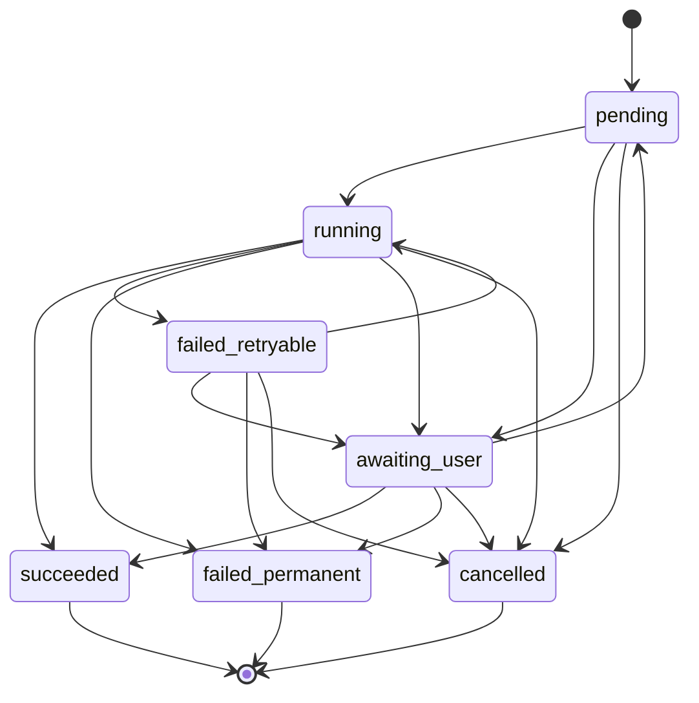

# Local architecture

This document is the design of the application as built, and why it is shaped so. What is decided
and not built yet stays in the section it belongs to, in a paragraph that opens
`**Not built yet.**` and names the open `ISA.md` claim or the issue it waits on.

The application is a native Windows application written entirely in .NET. It does not depend on
Python, WSL, OBS, FFmpeg, a browser, a backend of its own or a remote database.

The whole corpus lives on the user's machine:

- SQLite holds state, metadata and queryable projections;
- the filesystem holds audio and the large or immutable artifacts;
- Windows Credential Manager holds credentials;
- Deepgram is the external transcription service;
- Claude Code headless is an optional way to generate summaries, on the user's own account and
  plan, without integrating an LLM API key directly.

In this document, **local** means there is no cloud storage, authority or application service.
Deepgram and, when it is enabled, Claude Code still process data outside the application and need
the user's explicit consent.

The goal is not only to transcribe. It is to turn meetings into knowledge that is local,
queryable and verifiable by people and by LLM agents.

---

## 1. Decisions

### 1.1 A native, self-contained Windows application

**Stack: .NET 10 LTS, C#, WinUI 3 and the Windows App SDK.**

The application is responsible for:

- capturing the microphone and the meeting's audio;
- aligning both streams on one common timeline;
- showing levels, source and errors while recording;
- writing a recoverable spool;
- validating the audio before transcribing;
- calling Deepgram with the user's own key;
- keeping `deepgram.json` as a paid, immutable artifact;
- rendering the transcript, turns and projections without external tools;
- generating summaries through interchangeable providers;
- keeping a durable local queue;
- searching, querying and editing meetings;
- exporting the corpus.

**Not built yet.** Estimating the cost of a transcription before it is sent (ISC-85), a backup
snapshot and restoring one (ISC-111, §9). Export is built (`CorpusExport`, ISC-194.1 to .3).

FFmpeg is not required. The interchange format is linear PCM WAV, 16-bit, 16 kHz, two channels
(`CapturedAudio`). It is bigger than FLAC, but it removes a dependency and a risk. Compression is
added only if measured size or upload time justifies it.

### 1.2 Local persistence only

SQLite is the application's only database. There is no PostgreSQL, Supabase, object storage,
remote API or synchronisation between machines.

SQLite holds small, queryable data. The filesystem holds audio, original responses and large
derivatives. Blobs are not stored inside the database.

This split gives:

- transactions and constraints for local state;
- full-text search with FTS5;
- artifacts that can be inspected and copied without special tools;
- a queryable database that can be rebuilt from the stored sources;
- consistent backups without designing a distributed system.

### 1.3 Explicit external providers

Deepgram is a required integration for transcription, not part of the application's persistence.
The key is BYOK and is kept in Windows Credential Manager.

The summary can work in three ways:

- **Claude Code headless:** built; it uses the user's installation and authentication, on the
  person's own plan only;
- **API key:** **Not built yet.** An adapter for an LLM provider with the person's own key (#125);
- **transcribe only, or nothing:** the *Después de grabar* choice of *Solo transcribir* or *Nada*,
  where a meeting can exist and be searched without a summary.

The absence of Claude Code never blocks recording, transcription, rendering, search or recovery.

### 1.4 Local access for agents

The first interface for agents is a local MCP server over `stdio`, written in .NET and separate
from the GUI. It opens no port, does not expose SQLite to the network and needs no backend.

The MCP process uses the Windows user's permissions and offers a limited set of domain tools. It
gives no arbitrary SQL access and no internal paths except where a read operation needs one.

### 1.5 No anticipated cloud architecture

No tables, APIs or jobs are designed for a hypothetical cloud. If remote backup is needed later,
the first solution is one-way:

```text
verified local snapshot -> remote destination -> manual restore
```

That backup is an opaque, versioned copy of the corpus: not synchronisation, not remote editing
and not a second source of truth.

---

## 2. Overview

```text
┌──────────────────── WINDOWS APP — .NET / WINUI ────────────────────┐
│ WASAPI capture · timeline · meters · recovery · search              │
│ durable queue · Deepgram BYOK · summaries · local editing           │
└───────────────┬───────────────────────┬──────────────────────────────┘
                │                       │
                ▼                       ▼
       ┌─────────────────┐     ┌──────────────────────────────────┐
       │ SQLITE          │     │ LOCAL FILESYSTEM                 │
       │ meetings        │     │ spool and audio                  │
       │ jobs and states │     │ deepgram.json                    │
       │ turns           │     │ extractions/<id>.json            │
       │ summaries       │     │ transcript.md and derivatives    │
       │ decisions       │     └──────────────────────────────────┘
       │ actions + FTS5  │
       └────────┬────────┘
                │
                ▼
       ┌─────────────────┐
       │ LOCAL MCP .NET  │
       │ stdio/read-only │
       └─────────────────┘

Explicit integrations:

App ──HTTPS──► Deepgram
App ──optional local process──► Claude Code headless
```

---

## 3. Structure of the .NET solution

The UI holds no business rules. The solution is split by responsibility:

```text
MeetingTranscriber.slnx
  src/
    MeetingTranscriber.App/             WinUI, navigation and composition
    MeetingTranscriber.Domain/          entities, states and pure rules
    MeetingTranscriber.Audio/           WASAPI, timeline, spool and levels
    MeetingTranscriber.Infrastructure/  SQLite, filesystem and credentials
    MeetingTranscriber.Presentation/    what the application says, and in which language
    MeetingTranscriber.Processing/      Deepgram, transcript and summaries
    MeetingTranscriber.Recording/       recording a meeting into the corpus
    MeetingTranscriber.Mcp/             local MCP server over stdio
    MeetingTranscriber.Cli/             diagnosis, repair and automation
  tests/
    MeetingTranscriber.Testing/         temporary corpus, SQL and the fixture inventory
    MeetingTranscriber.Domain.Tests/
    MeetingTranscriber.Audio.Tests/
    MeetingTranscriber.Infrastructure.Tests/
    MeetingTranscriber.Processing.Tests/
    MeetingTranscriber.Presentation.Tests/
    MeetingTranscriber.App.Tests/
    MeetingTranscriber.Recording.Tests/
    MeetingTranscriber.Cli.Tests/
    MeetingTranscriber.Mcp.Tests/
    MeetingTranscriber.Isa.Tests/
    MeetingTranscriber.UiProbe.Tests/
    MeetingTranscriber.FakeClaudeCode/  a stand-in for the Claude Code executable
  tools/
    MeetingTranscriber.CorpusFixtures/
    MeetingTranscriber.Icons/
    MeetingTranscriber.UiProbe/
```

`docs/layout.md` says what each project holds and what it may reference.

Dependencies point towards the domain. WinUI, SQLite, WASAPI, Deepgram and Claude Code are
replaceable adapters around rules that can be checked without hardware or network.

`MeetingTranscriber.Testing` contains no tests: it is what a test opens. It reaches as far as
Infrastructure and no further — the domain's tests reference it, and a path from there to
Processing would let a domain rule be tested against the parser's output instead of against a
response.

Every text a person reads lives in `MeetingTranscriber.Presentation` and nowhere else. The
catalogue carries both versions of each text on the same line, so a text that exists in only one
language is not something that can be written; a screen names an entry and never carries the
words. It sits outside `App` for a hard reason, not a matter of taste: the Windows App SDK
compiles a module initializer into every assembly that references it, and that initializer starts
the runtime as soon as a type of the assembly is touched — so a catalogue living there could not
be read from any test. For the same reason `MeetingTranscriber.App.Tests` does not reference
`App`: what it can demand of it is its source code, and what it demands is that no screen carries
words of its own.

The command line shares the application's services with WinUI. It does not implement a second
pipeline. It serves diagnosis, import, rebuild and recovery, and it allows tests of the whole flow
without automating the graphical interface.

---

## 4. The local corpus

### 4.1 Location

By default the corpus lives in `%USERPROFILE%\MeetingTranscriber` (`ApplicationHome`,
`CorpusLocation.ApplicationFolderName`) and is configurable from the UI. It never lives inside the
installation directory or the MSIX package's data folder — `CorpusLocation` refuses application
data. That folder is wiped on uninstall, and the corpus holds paid artifacts that cannot be
obtained again.

Changing the folder from the UI moves the meetings (`CorpusMove`): if the chosen folder is empty,
the application offers to move them, and never while recording, saving or with work in progress.
The database is copied with SQLite's backup API and so is every other file of the corpus, except
what is transient by design; the copy is opened and every file the database lists is checked to
be there, whole, with its hash; only then is the new folder remembered. If anything is missing,
nothing is left written and the previous folder stays the corpus. The previous copy is deleted
only if the person asked, and only after finding the new one whole again.

```text
MeetingTranscriber/
  corpus.db
  runner.mark
  meetings/
    <meeting_id>/
      manifest.json
      audio.wav
      deepgram.json
      deepgram.v<n>.json
      transcript.md
      utterances.jsonl
      extractions/
        <extraction_id>.json
      summary.md
  spool/
    <meeting_id>/
      manifest.json
      changes.jsonl        (only if somebody moved a channel while recording)
      pauses.jsonl         (only if somebody paused the recording)
      loopback.blocks
      microphone.blocks
```

`docs/corpus.md` has every file, what it is and what a backup carries.

`manifest.json` does not replace SQLite. It is a minimal recovery card that makes it possible to
recognise which meeting a folder belongs to if the database is damaged or missing: its id, when it
started, which profile it was recorded with, in which language, and what it is called. It does not
list the files beside it — they are named for what they are, and a card that repeated them would
only repeat the directory listing.

### 4.2 Sources and derivatives

Sources, which are not overwritten:

- the spool's original blocks while they are the only recoverable copy;
- `audio.wav`, if the user's local policy decides to keep it;
- the `deepgram.json` received from the paid transcription;
- each accepted extraction under its own `extraction_id`;
- classification, names and corrections approved by a person;
- the state and owner of each action, which a person moves.

Rebuildable derivatives:

- `transcript.md`;
- `utterances.jsonl`;
- `summary.md`;
- the tables of utterances, summaries, decisions, actions and open questions;
- the FTS5 indexes.

A rebuilt row comes back as the extraction proposed it. What a person annotates on it is not in
that row: the state and owner of an action live in `action_item_progress`, pointing at the
extraction and the position inside it, and not at the id, which reprojection generates again. That
is the rule for every projected row somebody can annotate — decision, action and open question
carry the position for that reason — and the database rejects two decisions, two actions or two
open questions at the same position of the same run: two would not be a visible error, they would
be a note read against either. The position counts within its own list, so the first decision and
the first action of an extraction are both at position zero, and what tells them apart is which
list they came from.

A rerender never modifies `deepgram.json` or an earlier extraction. A new extraction creates a new
version and keeps the previous one.

A person may delete a meeting's audio, its transcript or the meeting, and `docs/corpus.md`
§Deleting and archiving says what each takes.

### 4.3 Durable writes

Important artifacts are written like this (`DurableArtifact`):

1. write a temporary file on the same volume;
2. flush buffers and close;
3. compute size and SHA-256;
4. validate that the content can be read back;
5. atomically replace the destination;
6. register the confirmed artifact in a SQLite transaction.

At start a reconciler examines temporaries, spools and files with no database row. It never
interprets the mere existence of a temporary as success.

---

## 5. The SQLite model

### 5.1 Tables

```text
schema_migrations
meetings
artifacts
capture_runs
capture_source_changes
processing_jobs
transcription_runs
extraction_runs
extraction_refusals
utterances
turn_sources
summaries
decisions
action_items
open_questions
action_item_progress
nodes
meeting_nodes
templates
template_nodes
template_people
people
affiliations
meeting_people
speaker_assignments
terminology_corrections
settings
audit_events
```

`schema_migrations` is EF's history table, named by `CorpusDatabase.MigrationsHistoryTable`.

FTS5 has eight external-content indexes (`CorpusIntegrity.SearchIndexes`): utterances, summaries,
meetings, nodes, people, decisions, action items and open questions. `utterances_fts_terms` is an
`fts5vocab` table over the first. Semantic search and embeddings stay out.

### 5.2 Meeting

Main fields:

```text
id UUID/TEXT PRIMARY KEY
title TEXT NULL
context TEXT NULL
started_at TEXT
duration_ms INTEGER NULL
source_profile TEXT
language TEXT
lifecycle_state TEXT
created_at TEXT
updated_at TEXT
deleted_at TEXT NULL
archived_at TEXT NULL
audio_removed_at TEXT NULL
```

`lifecycle_state` says only whether the meeting is active, being deleted or deleted — `active`,
`deleting` or `deleted` under a CHECK — and `deleted_at` is set exactly when it is not `active`.
It does not try to summarise every process. Archiving is a column, not a state: a meeting that is
put away is still an active one, and `docs/corpus.md` says why.

A meeting does not hang from a project: it relates to nodes of `nodes`, and each link says in what
way. A meeting about two projects is two `work_of` links; one with a client adds a `counterpart`
to the organisation on the other side; one that happened before the project existed hangs
directly from the organisation. The tree is at most three levels deep: it is a classification
somebody holds in their head, not a folder tree, and with the cap everything under a node is two
joins away.

### 5.3 Classifying a meeting

The vocabulary is closed. These are values stored under a CHECK, not labels of an interface, so
renaming any of them is another migration.

Node classes — what it is:

| Class | What it names |
| --- | --- |
| `organization` | An organisation of any kind: a client, a faculty, the one that runs a conference. Deliberately not `company` — calling them companies made the name lie. |
| `initiative` | A body of work that lasts: a project, a course, a line of support. |
| `topic` | A concrete matter: an incident, a ticket, a renegotiation. Never a root. |

Link roles — how the meeting relates to that node:

| Role | What it says |
| --- | --- |
| `work_of` | The meeting is work of that node. What used to be the project. |
| `counterpart` | The other side of the table: a client, the company interviewing, a partner. |
| `about` | What it is about, without being work of it. |

And on the people a meeting names, in `meeting_people`: `attended`, and `subject` when the meeting
is about that person. Both at once are two rows, because somebody's 1:1 is a meeting they attended
and are the subject of, and a termination is discussed before the person is in the room.

People are not nodes. Where they belong is `affiliations`: as many as they have —a contractor is at
two clients at once— and each with a from and an until, because a meeting is read years later and
without a period, hiring the candidate you interviewed rewrites the interview into a meeting with
one of your own employees. Both ends are open and not unknown: no from means "as far back as this
corpus reaches", no until means "still there".

A template is a classification somebody filled in by hand and saved under a name to use again:
which nodes it links and with which role, in `template_nodes`, and whom it names and how, in
`template_people`, with the same closed names and the same CHECKs as `meeting_nodes` and
`meeting_people`. A template only ever pre-fills: choosing one adds what it holds to what the
meeting already has, it cannot express what the constraints forbid, and no meeting records which
template filled it, so changing or discarding one touches no meeting already classified. A
template is put by with *Recordar*. The thirteen below are not templates: choosing one opens
places named in that meeting's own words and answers none of them, and each chip names its places
with the words of that meeting (*Universidad › Materia*, *Profesor*) without changing what is
stored.

#### The thirteen meetings the vocabulary was closed against

Each is stored without inventing rows, and found by organisation, by initiative or by person.
`ClassificationStoriesTests` is the thirteen in one corpus.

| # | Meeting | How it is stored |
| --- | --- | --- |
| 1 | University class | `work_of` the course. The faculty is reached through the tree, with nothing naming it. |
| 2 | Casual chat | No links. It shows in the unclassified list and in text search. |
| 3 | Interview, me as candidate | `counterpart` the company. There is no project and none needs inventing. |
| 4 | Interview, me interviewing | `work_of` my organisation; the candidate with the affiliation of then, which hiring them does not overwrite. |
| 5 | Two projects | Two `work_of`. |
| 6 | Salesperson with a client | `work_of` the initiative and `counterpart` the client. |
| 7 | PM with their team | `work_of` the initiative; each contractor with their open affiliations. |
| 8 | Conference | `about` the conference. Two hundred attendees who are not entered, and no row pretending they are. |
| 9 | Meeting between two companies | Two `counterpart`, and no link inventing an owner. |
| 10 | HR terminating | `work_of` my organisation; the person as `subject`, whether or not they were there. |
| 11 | Recurring 1:1 | `work_of` the organisation, no project; the person `attended` and `subject`. |
| 12 | Daily | `work_of` the initiative. |
| 13 | After-sales support | `work_of` the ticket, which is a `topic`, and `counterpart` the client. |

Two things stay out on purpose, and neither is classification: the series that relates the two
hundred dailies of the same team to each other, and the retention policy of a sensitive meeting.

#### The crossings

The thirteen closed the vocabulary and remain thirteen: the two here are numbered apart for
exactly that reason. What none of them brings is the crossing: somebody with a job, a second job
and a degree, in a meeting that is work of one of the jobs and is about something of the degree.
It reads as absurd until it happens. `CrossedStoriesTests` is these two in the same corpus as the
thirteen.

| # | Meeting | How it is stored |
| --- | --- | --- |
| Crossing 1 | Work meeting that touches the thesis | `work_of` the job's initiative and `about` the master's, which is an initiative of the faculty. Three open affiliations on the person, one of them the faculty. |
| Crossing 2 | Meeting with the client where I also work | `work_of` the initiative of one employer and `counterpart` the other. The two open affiliations stay open and neither shows on the meeting. |

**Where the person was standing is not stored, and that is deliberate.** An affiliation says where
somebody belongs and during which period; a link says how the meeting relates to a node. Crossing
the two — saying Sam was there *as* Orchard — would assert something nobody recorded, and a
meeting read two years later would say it was with the wrong company. When somebody needs that
answer, it is a new column on `meeting_people` with a decision behind it, and the test that today
pins the four columns of that table (`ClassificationStoriesTests` reads
`pragma_table_info('meeting_people')`) is what will make it visible.

That the faculty is an `organization` is not a coincidence we took advantage of: it is what that
word was chosen for instead of `company`, and the CHECK on `affiliations.organization_kind` is
what makes a degree stored the same way as a job without inventing a new type.

### 5.4 Independent jobs and states

Capture, finishing, transcription, extraction, rendering and backup are separate jobs. The kinds
`processing_jobs.kind` allows are `backup`, `capture`, `extract`, `finalize`, `render` and
`transcribe`; the runner runs `transcribe` and `extract` only — capture and finishing happen
inside the recording, rendering is a step of filing and a launch chore, and backup is not built.
Each job contains:

```text
id
meeting_id
kind
state
attempt
idempotency_key
created_at
started_at
finished_at
last_error
next_attempt_at
awaiting_reason
failure
```

Common states:

```text
pending
running
awaiting_user
succeeded
failed_retryable
failed_permanent
cancelled
```

This allows a meeting to be transcribed even though its summary failed, or to be queried while a
backup is pending.

Valid transitions, and there are no others (`JobStates`):


```mermaid
stateDiagram-v2
    [*] --> pending
    pending --> running
    pending --> awaiting_user
    pending --> cancelled
    running --> succeeded
    running --> failed_retryable
    running --> failed_permanent
    running --> awaiting_user
    running --> cancelled
    failed_retryable --> running
    failed_retryable --> awaiting_user
    failed_retryable --> failed_permanent
    failed_retryable --> cancelled
    awaiting_user --> pending
    awaiting_user --> succeeded
    awaiting_user --> failed_permanent
    awaiting_user --> cancelled
    succeeded --> [*]
    failed_permanent --> [*]
    cancelled --> [*]
```

The runner starts by itself the jobs in `pending` and `failed_retryable`, and only once their
`next_attempt_at` has arrived. `awaiting_user` is deliberately outside that list and has no retry
date: it is where what the application does not decide alone stops —a cost to approve, an attempt
whose result cannot be established— and it leaves only because a person moved it. The exception
is `awaiting_user → succeeded`, which is a restart finding the already paid response on disk:
resolving the job with what was already charged is not retrying it. `Requeue` is the one move a
person makes on a job that already ran.

`succeeded`, `failed_permanent` and `cancelled` are terminal. Trying that work again is a new job
with its own `idempotency_key`, not this one revived.

### 5.5 SQLite configuration

- foreign keys on;
- WAL, so reads are possible while the application writes;
- `busy_timeout` of 5 seconds;
- forward-only, versioned migrations;
- a single layer responsible for opening connections and transactions;
- an integrity check, which the `check` command runs (`CorpusIntegrity.Check`);
- UTC timestamps and whole-millisecond durations.

**Not built yet.** Running the integrity check before a backup is made (§9).

The database can rebuild its projections from artifacts, but the human layer must also be part of
every backup because it cannot be inferred.

---

## 6. The whole flow of a meeting

### 6.1 Identity before audio

Pressing record creates a `meeting_id` UUID, a SQLite row, a spool directory and a minimal card.

The card (`SpoolManifest`) holds:

```text
meeting
capture_run
started_at
source_profile
others_capture_mode
sources: for each channel, channel, heard, and device when there is one
```

Channel 0 never carries a device id, because neither of its two forms is a device: what says
which of the two it was is `others_capture_mode`.

It is written once and not touched again. Everything that changes while recording —how far each
source got, what could be recovered— lives in the blocks, which is where a cut write costs one
packet; a card rewritten at every block would be exactly the twisted write the spool exists to
avoid. It does not list the files beside it or their formats: they are named for the source they
carry and each declares its own.

What changes while the meeting goes on —channel 0 moved to the whole machine or to another
program, with the mode it moved to, a microphone chosen or followed when Windows took one away—
goes in `changes.jsonl`, beside the card: one line per change, written whole at once and never
rewritten, saying when it was, what it listens to from there and what it listened to before. The
card says what each channel opened with and this says what it ended with, so a folder recovered
after an abrupt close does not claim that the machine's notifications stayed out of the file when
they came in halfway through the meeting. The only thing a change may erase is the unfinished tail
left by the previous change failing: it is written before the handover, so a write that fails is a
move that did not happen, and what managed to fall says nothing. It is discarded before writing
over it, so two writes never stick together into one complete, unreadable line.

Identity does not depend on the title, a file name or a connection to a provider.

### 6.2 Capture

Two streams are opened:

- **loopback:** the audio of the selected process, or everything the machine plays;
- **microphone:** the selected microphone.

The channel contract is stable:

```text
channel 0 = loopback
channel 1 = microphone
```

Both name a source of audio and not a person. A channel is deterministic about which device the
sound came in through, and does not say how many people spoke through it: two people in the same
room share a microphone.

The two forms of channel 0 are the same call: `ActivateAudioInterfaceAsync` with process
loopback, including the tree of the chosen process, or excluding the tree of the application
itself — which is everything else on the machine. Neither opens a device. Edge and Firefox work,
Teams opens and is unproven, and Zoom has not been probed: `docs/process-capture.md` says what ran
and what did not, because the audio may come from helper or shared processes.

Channel 0 is not the audio of one output: it is what this machine plays, wherever it goes out, so
with speakers and headphones at once both come in. The playback endpoint is not recorded with a
loopback because an endpoint delivers nothing while nothing sounds through it —neither silence nor
packets— and keeping it awake made recording depend on being able to open a playback. The format
is still read from the default endpoint, which is the one thing the virtual device does not say:
asking it is not playing through it. `docs/process-capture.md` has what was measured and what was
not.

If the selected process produces no audio, the UI offers the whole-machine loopback and warns that
it may include notifications and other applications. It offers: nothing moves channel 0 alone.
Accepting moves the channel with the meeting in progress — the same recording, the same spool, the
packets placed where the previous ones left off — and the change is written beside the card. A
followed program that goes away mid-meeting is said on the screen, with the same two presses as
nothing arriving.

If the API is not available or Windows refuses to follow the process, the recording does not start
and says why. Opening the whole-machine loopback instead would produce a file with all the
notifications and every other application from a press that asked for one program, and that is not
decided on anybody's behalf.

A process that cannot be followed does not fail: Windows accepts any PID and delivers a silent
stream. What detects a wrong process is the meter, never an error, which is why channel 0's level
is part of the recording screen and not a diagnostic detail. The rule is a single one: channel 0
follows a program, has heard nothing since it opened, and ten seconds have passed.

The minimum Windows: the package declares build 22000 (`Package.appxmanifest`), and process
loopback's own floor, build 20348, is checked before a recording opens
(`ProcessLoopback.IsAvailable`); the application does not wait for a recording to fail to find an
absent API.

### 6.3 Common timeline

Microphone and loopback may belong to different physical clocks. Accumulating their samples
independently produces drift.

The audio engine:

1. keeps the device position and the QPC timestamp of every WASAPI packet;
2. correlates both streams on a monotonic timeline;
3. keeps silences and discontinuities as real gaps, except for a pause: the spool keeps receiving
   blocks while paused, and `pauses.jsonl` says, in the clock of the packets themselves, which
   stretches were pause, so `audio.wav` leaves them out when it is materialised and the meeting
   lasts what was recorded;
4. converts each source to a known internal format;
5. corrects drift gradually during resampling;
6. materialises stereo WAV at 16 kHz without changing the logical order of channels.

The timeline is a component independent of WinUI and WASAPI. It can receive synthetic packets to
test drift, gaps, restarts and disorder.

The acceptance criterion is under 50 ms of accumulated divergence after two hours, measured with
known signals (`TimelineDriftTests`, ISC-66). Constant input/output latency and accumulated drift
are reported separately.

### 6.4 Recoverable spool

While recording, independent blocks are written per source along with their timestamps. An
incomplete block can be discarded without losing the earlier ones. Keeping the meeting does not
depend on closing a WAV properly: a WAV's length lives in a header written on closing, so a
recording would be readable only at the exact moment an abrupt close takes away.

Each block carries the same as the packet that produced it — the device's frame position, the
instant it read it and whether the device vouches for it — because that is what places the audio,
and a spool that only kept samples would come back as a recording with every gap closed. Each file
declares its own format in its header: one file is enough to read a source, and there is no second
route through which to lose it.

A block reaches the disk in a single write, so a dead process leaves whole blocks and not half a
block. What a power cut can leave — a tail that frames correctly and is not audio — is detected by
each block's checksum.

On stopping:

1. the streams are closed and verified;
2. the timeline is rebuilt;
3. `audio.wav` is generated as a temporary;
4. duration, channels, levels and readability are verified;
5. the hash is computed;
6. the artifact is registered;
7. only then is the redundant spool removed.

If the application ends abruptly, the next start offers *Conservar* and *Descartar* on the
meetings list for the recording, explicitly. It never discards it silently. Exporting a waiting
recording is the command line's (`recovery --export`, `recover --export`).

Start reads each spool's card and size, and never the blocks: two hours are hundreds of megabytes
per source, and a list that walked them would be one nobody waits for. Reading a whole recording is
what keeping or exporting does, on a single one, because somebody asked. Discarding is the only
thing in the product that deletes a recording, and it is reached only from that decision on that
recording.

Nothing takes a folder off the list. One with no card is still a recording —each file declares its
format—, and one whose card was split in half is offered saying why it cannot be named: a damaged
folder bringing the list down would be the abrupt close winning twice. What is said apart is the
one still being recorded, because the three decisions refuse it: two would read a file that is
still growing and the third would throw away a meeting that is happening.

While nothing turns a spool into a meeting, a recording somebody stopped and one the machine cut
off are the same folder. Both are offered: asserting a difference the disk does not record would be
inventing it.

### 6.5 Cost gates

Before calling Deepgram:

- the meeting's audio is in the corpus with its hash and is on disk (`TranscribingAMeeting`:
  nothing is sent otherwise);
- a first transcription is refused when a response is already filed;
- the source profile agrees with the number of channels;
- the language the meeting is spoken in is set;
- the run records the audio's SHA-256 and the hash of the billable configuration
  (`transcription_runs`).

Readability, length and levels are checked when the recording is saved (§6.4, step 4), not before
the call.

**Not built yet.** Showing the minutes that would be sent and asking for approval (ISC-85), except
at the prompt: `deepgram-live` and `transcribe-again` send only after a person types the minutes
back (`TypedBack`).

No screen shows money: no provider quotes a price before a call, and a figure written without
that quote would be invented. The dialogue that approves a transcription says how many minutes
will be sent; the one for a summary says the model and no figure.

### 6.6 Transcription

Profiles:

```text
multichannel = audio captured by the app, two channels
diarize       = a single-track file brought in
```

A `diarize` meeting is a file imported with `import-audio` and `import-response --profile
diarize`.

Deepgram is called directly from the desktop with the BYOK key. The key is taken from Credential
Manager only for the duration of the operation and is not written to logs, SQLite, manifests or
process arguments.

After a complete response:

1. it is saved locally with a durable write;
2. the JSON and its minimal structure are validated;
3. SHA-256 is computed;
4. the artifact and the run are registered;
5. the transcript, utterances and projections are generated.

`deepgram.json` is the skip condition for the same audio hash and the same billable
configuration. It is not overwritten. A voluntary retranscription writes `deepgram.v<n>.json` as a
new version and needs explicit cost confirmation; today it is the prompt's `transcribe-again`.

There is an unavoidable window in which Deepgram may have charged and the app may die before
saving the response. In an architecture with no backend that limit is accepted. A job found
`running` after a restart goes to `awaiting_user` (`JobsARestartFound`); a call whose charge is
uncertain is never retried automatically.

### 6.7 Transcript and projections

The .NET renderer turns `deepgram.json` into:

- turns ordered by time;
- `utterances.jsonl` with the original labels;
- a readable `transcript.md`;
- `utterances` rows for search and citations;
- participants pending human resolution.

The microphone channel assigns the user only when it brought a single speaker: nobody else could
have been there. With two, which is which is exactly what the recording does not know, so neither
is assigned. The other diarized speakers are probabilistic and are kept as labels until a person
assigns them.

Names and corrections are applied at render time. They are never written into `deepgram.json` or
into the raw evidence used to validate citations.

---

## 7. Summary and Claude Code headless

### 7.1 Common contract

Every summary provider implements `ISummaryProvider`:

```text
Name
IsAvailableAsync
ExtractAsync(meeting_input, schema, cancellation_token)
```

`ExtractAsync` makes one extraction, or one correction of a refused one. There is no cost
description: no provider quotes a price.

An extraction records:

```text
extraction_id
meeting_id
provider
provider_version
model
prompt_version
schema_version
created_at
input_hash
raw_output_hash
accepted_at
chosen_at
corrects_run_id
session_id
```

The structured result (schema `"1"`, `ExtractionReader.SchemaVersion`) carries `schema_version`,
`meeting_id`, `abstract`, an optional `title`, `summary`, `participants`, `decisions`, `actions`,
`open_questions` and evidence, and refuses any key it does not name. Topics are not among them: what
a meeting is about is filed by a person when classifying it, and the reader refuses a `topics`
field.

### 7.2 The Claude Code adapter

Claude Code is an optional dependency chosen by the user. The app detects the executable, shows
its availability and allows its path to be configured. It does not try to install it or to sign in
for the user.

Each meeting is processed in a new process to avoid contamination between contexts. The app
creates a fresh temporary workspace per run, under `%TEMP%\meeting-transcriber-summaries`, deleted
afterwards, which contains only:

- the transcript or the turns required;
- authorised human context;
- versioned instructions;
- the output schema.

The headless invocation:

- does not reuse a session from another meeting;
- is started with no tools (`--tools ""`), `--strict-mcp-config`, `--setting-sources project` and
  `--no-session-persistence`, and asks for JSON output;
- grants no access to the whole corpus or to credentials;
- captures stdout, stderr, exit code, timeout, version and the session ID when available;
- runs on the person's own account only, with an environment built from an allowlist
  (`ClaudeCodeSummaries.AllowedEnvironmentNames`), so an `ANTHROPIC_API_KEY` never reaches a run;
- lasts ten minutes at most, and is refused under a Claude Code memory file above the workspace;
- can be stopped from the meeting screen (*Detener*);
- is tested against `tests/MeetingTranscriber.FakeClaudeCode`, without spending quota or credits.

**Not built yet.**

- The authorised human context: nothing lets a person authorise one (`MeetingInput` says so).
  The bullet stays because it is the design that comment cites.
- Stopping the automation when the CLI reports no quota or a move to paid use (ISC-190.2).
- The screen saying, before automatic summaries are turned on, that the text is sent (ISC-190).

The integration with the CLI is isolated behind the adapter because its flags and its envelope may
change. A change in Claude Code does not modify domain rules, storage or validation.

Claude Code allows signing in with user plans, but headless use and its credits or limits may
change independently of the interactive plan. The app does not promise zero cost: it avoids
inheriting an accidental API key. The text is still sent to the provider.

### 7.3 Validation

An extraction is accepted only if:

- it meets the JSON schema;
- its speakers exist in the meeting;
- each citation points at the start of an existing turn;
- the cited text belongs to that turn;
- decisions, actions and open questions include evidence;
- it does not mix IDs, participants or content of another meeting;
- its `input_hash` matches the prepared input.

A citation keeps at least (the six fields `CorpusNamingTests` pins):

```text
utterance_ordinal
start_ms
end_ms
speaker_label
quoted_text
source_artifact_sha256
```

A turn is named by the meeting and its position within it, never by its id. Ids are handed out by
the projection, so a rebuild deletes them and issues others; the pair of meeting and ordinal is
what the projection reproduces from the same `deepgram.json`, and that is why it is what survives.
The meeting is not stored apart: it is that of the decision or action carrying the citation, so
there is no way to cite a turn of another meeting.

### 7.4 Guided correction

A model returns JSON almost always and almost never every time. Rejecting and retrying the whole
extraction spends the same as correcting it and throws away the part that was right, so a rejected
extraction is returned **once**, with what failed, and what comes back goes through the same
conditions of §7.3 as the first.

The correction goes in a new process that receives the previous output and the errors, never
resuming the previous session: the CLI's flags and envelope change, and the attempt has to be
testable with a fake executable. It goes through the same adapter and the same workspace, so a
correction sees no more of the meeting or of the corpus than the attempt it corrects.

What can be corrected is the decision that matters, and there are two classes:

- **The form.** It is not JSON, it does not meet the schema, a field is missing, a type is not what
  it says it is. It is returned and accepted corrected like any other.
- **What the meeting does not support.** A citation to a turn that does not exist, a cited text
  that is not in that turn, a speaker the meeting does not have, a participant or content that
  did not come out of this meeting. It is returned asking to **remove the statement**, and it is
  accepted only without it. If it comes back with the same statement pointing at something else,
  it is rejected.

That second rule is the whole point. Asking a model to fix a citation that does not resolve is
inviting it to look for one that passes the check, and a citation chosen to pass the check is
exactly what validation exists to catch: the corpus would fill with statements with plausible and
false evidence, which is worse than not having the statement. A statement without support falls;
support is not looked for.

An `input_hash` that does not match is not corrected: the response was not produced against the
input that was prepared, and there is nothing there to correct. It is a failed run outright.

A single correction, and then a failed run. A second attempt on the same context rarely brings
anything new and each one spends the user's quota, which the app does not promise is free (§7.2).

A provider error —a timeout, a process that dies— leaves the job retryable. A rejected extraction
is a failed run: the job ends and the meeting offers the summary again, with nothing retrying it by
itself. Neither modifies the last accepted extraction. Retrying a summary never calls Deepgram
again.

---

## 8. Query, editing and local MCP

### 8.1 Search

FTS5 covers:

- title and human context;
- companies, projects and participants;
- abstract and summary;
- transcript;
- decisions, actions and open questions;
- voices somebody has named.

*Participant* and *voice* are not the same, and neither becomes the other. A participant is
somebody a person put in the meeting; a voice is somebody the corpus knows spoke in it, because
somebody named a speaker label. Searching a name brings the meetings where that person appears
and the meetings where they spoke, and those are different sets: somebody can have spoken in a
meeting without appearing in it, and appear in one without having said anything.

The main screen's search ranks a meeting by where the word is — filed under or called, then
summary, then transcript, then a similar word (`MeetingSearch`, ISC-226) — and a corrected term
also finds the meetings where it came out the wrong way (ISC-199).

Search returns small results with `meeting_id`, date, title, snippet and the relevant timestamps.
The full transcript is opened only when necessary.

### 8.2 MCP tools

Read-only tools:

```text
buscar_reuniones(query, filtros)
leer_resumen(meeting_id)
leer_turnos(meeting_id, desde_ms, hasta_ms)
obtener_cita(meeting_id, utterance_ordinal)
listar_decisiones(filtros)
listar_acciones(filtros)
listar_nodos(filtros)
leer_nodo(nodo_id, filtros)
```

`filtros` is filled by `limite`, `desde` and `hasta`, and paging is `saltar`
(`CorpusServerTests` spells the parameters of each tool). The tool and parameter names are in
Spanish because they are the wire names an agent calls.

The expected pattern is:

1. search;
2. read the summaries of a few results;
3. open only the turns needed;
4. answer with `meeting_id`, timestamp, citation and source hash.

The third way in is not through a meeting but through a node: `listar_nodos` gives the id and
`leer_nodo` reads the history — what was decided, left to do and left open in all the meetings
hanging from it and from what hangs from it — in order and with no opinion about what still
stands.

The MCP server is another executable of the same solution. It opens SQLite read-only, respects
paging and size limits, and shares the application's domain queries. Every request is appended to
`%LOCALAPPDATA%\MeetingTranscriber\agent-requests.jsonl` (ISC-100).

The MCP client launches it by a stable name, not by its path: inside an MSIX package the
installation directory changes with every version, so the executable is exposed through an *app
execution alias* declared in the manifest. That an installed build reaches it by name is ISC-113,
open.

Write tools are outside the MVP. A future editing through agents requires explicit human
confirmation and auditing.

---

## 9. Backups and recovery

What exists today is the export (*Exportar*, with its four ticks, ISC-194) and moving the corpus to
an empty folder (§4.1). `CorpusIntegrity.Ensure` is what a backup will run first; nothing runs it
today.

### 9.1 Local snapshot

**Not built yet.** A backup snapshot (ISC-111). The design:

The app creates backups in a directory chosen by the user, ideally on another drive. A snapshot
contains:

```text
backup-manifest.json
consistent corpus.db
source artifacts
human layer
SHA-256 hashes
schema version
```

SQLite's backup API or an equivalent snapshot mechanism is used; an open database is not copied
directly in the hope that it is consistent.

A backup counts as successful only after verifying the manifest, the hashes and opening the SQLite
copy. The application offers a trial restore to a different folder before replacing an active
corpus.

### 9.2 Future remote backup

If a cloud is added, its initial scope is uploading closed, verified snapshots. It introduces no
remote database and no entity synchronisation.

```text
active local corpus
       │
       ▼
immutable, optionally encrypted snapshot
       │
       ▼
remote destination
```

Restoring is always a manual and explicit operation. The local corpus remains the only source of
truth.

---

## 10. Security and privacy

- API keys are kept in Windows Credential Manager.
- Secrets never appear in arguments, logs, SQLite or error reports.
- The corpus inherits the ACL of the Windows profile.
- The temporary summary workspaces contain only the meeting needed.
- Temporaries are deleted after an extraction; nothing keeps one.
- Logs and dumps contain no audio, full transcript or raw responses.
- The settings cards name both engines, Deepgram and Claude Code.
- Deletion distinguishes between rebuildable derivatives, sources and backups.

**Not built yet.** The stronger promise that the user sees which provider will receive audio or
text before enabling it (ISC-190).

Before using the application outside a controlled group, a recording notice, consent where it
applies, a retention policy and a review of the terms of Deepgram and of the provider used for
summaries are needed.

Immutability protects against accidental overwriting; it does not prevent a deletion the user
asked for.

---

## 11. Windows distribution

The application is packaged as MSIX from the first version. The packaging is one; the channels are
two:

```text
signed MSIX ──sideload──► alpha, with no review in between
            ──Partner Center──► public distribution
```

**Not built yet.** The Store channel. The sideloaded alpha is `docs/packaging.md`.

Packaging from day one avoids rewriting distribution later and settles signing: the Store signs
the package and no Authenticode certificate has to be bought. During the alpha the same package is
installed by sideloading with a certificate of our own, without going through Store review at
every iteration.

Consequences the rest of the design has to respect:

- the corpus never lives in the package's data folder, because uninstalling an MSIX app wipes it
  and the corpus holds paid, irrecoverable artifacts;
- the installation directory is read-only and its path changes with every version, so the CLI and
  the MCP server are published through an *app execution alias* declared in the manifest, which
  gives a stable name on the `PATH`;
- the microphone is declared as a manifest capability and consented to on use;
- publishing requires an accessible privacy policy, because the application sends audio and text
  to external providers: Store policy 10.5.1 makes it mandatory for any Win32 product that
  accesses personal information;
- Claude Code is non-integrated software the application may depend on, so policy 10.2.4 requires
  declaring that dependency at the start of the listing's description;
- launching Claude Code from a packaged app starts the child process inside the package's context:
  the environment sanitising of section 7.2 is tested before building the adapter, not after.

During the alpha:

- x64 self-contained build inside the MSIX, so no prior runtime is required;
- per-user installation, without administrator privileges;
- manual updates;
- diagnosis from the prompt through the alias waits on ISC-113.

At launch the application:

- resolves the corpus folder and says so when it will not open;
- runs the four chores of `WhatALaunchOwes.InOrder`: jobs a restart found, deletions to finish,
  meetings nobody recorded, and owed renders;
- starts the runner.

Claude Code is asked about when the settings screen opens; the Deepgram key when a transcription
is sent; the microphone's consent is Windows'.

Before public distribution:

- a verified developer account in Partner Center;
- a privacy policy published and linked from the listing;
- disclosure of the recording and of the sending to external providers;
- CI and tests on a Windows runner;
- tests of clean installation, upgrade, rollback and restore;
- ARM64 evaluation according to demand.

MSIX, portable and several installers are not maintained at once without a measured need.
Publishing also through winget or GitHub Releases is evaluated after the first public version, and
only if the same package is enough.

---

## 12. Testing

### 12.1 General rule

Automatic tests are offline and never spend credits or quota. Deepgram and Claude Code are replaced
by fake servers and processes.

Live tests are separate commands, need explicit opt-in, show the maximum cost before running and
are never part of `dotnet test`.

### 12.2 Characterisation from `deepgram.json`

Existing artifacts make it possible to test most of the system for free:

- parsing of real responses;
- multichannel time ordering;
- grouping of turns;
- detection of empty channels;
- Markdown and JSONL rendering;
- speaker assignments;
- human corrections;
- citations and validation of summaries;
- rebuild of SQLite and FTS5.

Byte-for-byte identical text is not required. The tests check domain invariants and documented
intentional differences (`docs/reference-behaviour.md`).

Those responses are not read from the user's corpus: they are versioned in
`tests/fixtures/deepgram/` with every word replaced by one from a closed vocabulary and with the
timings, confidences and channel numbers as the provider sent them. No test depends on the real
corpus, and one that needs a case the set does not cover extends the set. The corpus has no
single-track meeting and no empty channel, so those two are derived from a real response and the
folder's README says exactly how.

### 12.3 Audio engine

The engine consumes synthetic packets with a timestamp and returns aligned audio
(`tests/MeetingTranscriber.Audio.Tests`).

Cases:

- slightly different clock rates;
- different formats and sample rates;
- gaps and silences;
- discontinuities and late packets;
- abrupt end;
- device change;
- two hours of simulated drift;
- accidental channel inversion;
- recovery of a last incomplete block;
- idempotence when finishing the same spool twice.

### 12.4 Windows integration

Probed by hand; `docs/process-capture.md` is the record of what ran.

- microphone and loopback with known signals;
- target process and tree of children;
- moving from a program to the whole machine with the meeting in progress;
- speakers taken in exclusive mode by another application;
- Teams, Zoom, Meet and browsers;
- speakers, USB and Bluetooth headsets;
- suspend and resume;
- device change and disconnection;
- forced close and recovery;
- installation and update on a clean machine.

### 12.5 Paid live tests

The paid checks are the prompt's `deepgram-live` and `claude-live`: separate commands, never part
of `dotnet test`, with a ceiling, and the minutes typed back before anything is sent. A small set
of known audios periodically validates the real integration with Deepgram. Each run:

- uses a test account or project;
- has a maximum budget;
- requires interactive confirmation;
- saves the new artifact as a fixture only after a privacy review;
- compares structure and invariants, not exact wording.

The price per minute is external and may change; the architecture does not depend on a fixed
figure to consider the tests cheap.

---

## 13. Work

Work is queued as GitHub issues. The project board is a view for people. The `github` skill says
how a card moves, and what each feature has to make true is `ISA.md`'s, in the `### F<n>` block.

---

## 14. Main risks

1. **Drift between microphone and loopback.** It is the biggest technical risk and is validated
   before WinUI is completed.
2. **Multi-process capture.** The visible PID may not be the one emitting the audio; it is always
   possible to move to the whole machine with the meeting in progress.
3. **System echo in the microphone.** It may duplicate voices even though the channels are
   aligned in time; it has to be measured and explained to the user.
4. **Charge without an artifact.** Without a backend there is no exactly-once guarantee around
   Deepgram; an uncertain state needs a human decision.
5. **Loss of the only disk.** Local-first needs visible external backups and a proven restore.
6. **SQLite and the filesystem outside a common transaction.** The reconciler and the hashes are
   part of the design, not a later repair.
7. **Changes in Claude Code.** The integration depends on an optional external CLI and has to stay
   behind an adapter tested with fakes.
8. **False equivalence with the previous system.** Rewriting is acceptable, but the invariants of
   paid artifacts, the human layer and citations cannot be lost.
9. **Privacy.** Persistence is local, but transcription and summary may send audio or text to
   external providers.
10. **WAV growth.** PCM simplifies the MVP at the cost of size; it is measured before introducing
    compression and another surface for failures.

---

## 15. Exit criteria for the first version

They are in `ISA.md`, as claims with their closed mark and the `progress: M/N` count in the
heading.

---

## 16. Deferred decisions

Deliberately left out of the first versions:

- PostgreSQL and any remote database;
- Supabase or another Backend as a Service;
- remote object storage;
- a web client;
- synchronisation between devices;
- users, tenants and billing;
- server-side workers;
- remote MCP;
- embeddings and vector search;
- automatic summaries with managed credentials;
- integrated cloud backup.

These pieces are reconsidered only when a real need cannot be solved with the local application and
corpus.

---

## 17. Technical references

- [.NET support policy](https://dotnet.microsoft.com/en-us/platform/support/policy)
- [WinUI 3 and the Windows App SDK](https://learn.microsoft.com/windows/apps/winui/winui3/)
- [Application loopback sample](https://learn.microsoft.com/samples/microsoft/windows-classic-samples/applicationloopbackaudio-sample/)
- [WASAPI capture](https://learn.microsoft.com/windows/win32/coreaudio/capturing-a-stream)
- [SQLite backup API](https://www.sqlite.org/backup.html)
- [SQLite FTS5](https://www.sqlite.org/fts5.html)
- [Deepgram authentication](https://developers.deepgram.com/guides/fundamentals/authenticating)
- [Claude Code CLI reference](https://docs.anthropic.com/en/docs/claude-code/cli-usage)
- [What is MSIX](https://learn.microsoft.com/windows/msix/overview)
- [Packaging decision guide](https://learn.microsoft.com/windows/apps/package-and-deploy/)
- [Packaging extensions, including the app execution alias](https://learn.microsoft.com/windows/apps/desktop/modernize/desktop-to-uwp-extensions)
- [Microsoft Store policies](https://learn.microsoft.com/windows/apps/publish/store-policies)
