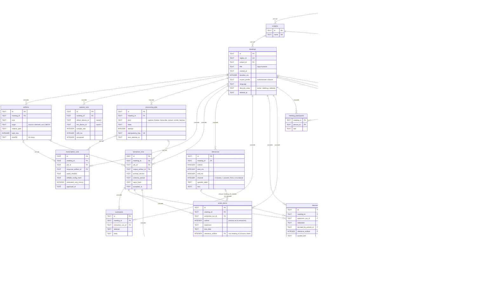
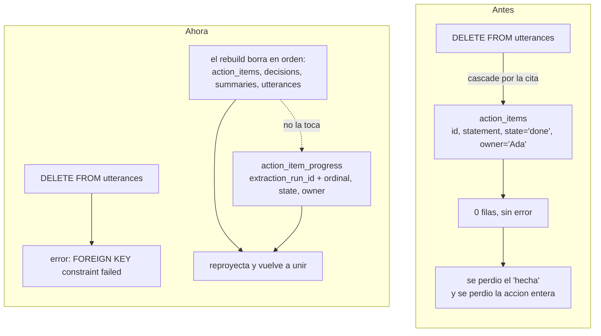

# El corpus en SQLite, y el problema que arreglé

## 1. El esquema completo

Cada tabla lleva de qué lado de la línea está: **fuente** (no se recupera de nada que quede en la
máquina) o **derivada** (se puede volver a producir desde las fuentes). Esa distinción es de la que
cuelgan el backup, el borrado y el rebuild.



Fuera del diagrama quedan `utterances_fts` y `summaries_fts`: son tablas virtuales FTS5 de
contenido externo, mantenidas por triggers, y no tienen foreign keys. EF no las modela.

### Los tres grupos

| Grupo | Tablas | Qué pasa si las borro |
| --- | --- | --- |
| **Derivadas** | `utterances`, `summaries`, `decisions`, `action_items`, ambos FTS5 | Nada. Se reproyectan desde `deepgram.json` y las extracciones aceptadas. |
| **Capa humana** | `people`, `projects`, `meeting_participants`, `speaker_assignments`, `terminology_corrections`, `action_item_progress`, más el título y la clasificación de `meetings` | Se pierde para siempre. No sale de ningún artefacto. |
| **Registro** | `artifacts`, `capture_runs`, `processing_jobs`, `transcription_runs`, `extraction_runs` | Se pierde qué se pagó y en qué estado quedó cada cosa. |

---

## 2. El problema

`action_items` estaba declarada derivada — el rebuild la borra entera y la vuelve a proyectar — pero
guardaba dos columnas que ninguna extracción produce:

- `state`: si la acción está abierta, hecha o descartada. Lo mueve una persona.
- `owner_person_id`: quién la tomó. Lo decide una persona.

O sea que la tabla era mitad derivada y mitad fuente, y el rebuild se llevaba la mitad que no lo
era.

Y encima había una segunda vía de pérdida. La cita de cada decisión y cada acción apunta a la
`utterance` de donde salió, y esa foreign key era `ON DELETE CASCADE`. Un rebuild **empieza**
borrando los turnos. Resultado: `DELETE FROM utterances` se llevaba decisiones y acciones enteras,
sin error, sin aviso, sin filas de vuelta.



### Por qué la clave no es el id de la acción

Ésta es la parte que decide todo lo demás. Un rebuild borra las filas y las vuelve a insertar, y
las filas nuevas tienen **ids nuevos**. Si `action_item_progress` apuntara a `action_items.id`, la
fila humana quedaría huérfana en cuanto se reproyecta — y si esa referencia fuera una foreign key
de verdad, se borraría con cascade, que es exactamente la pérdida de datos original con un
constraint arriba.

La clave tiene que ser algo que la reproyección **reproduzca igual**. Lo único que cumple eso es de
dónde salió la acción y en qué posición venía dentro de esa extracción:

```
PRIMARY KEY (extraction_run_id, ordinal)
```

El `extraction_run_id` es fuente: la extracción aceptada no se reescribe nunca. El `ordinal` es la
posición en el JSON de esa extracción, así que leer el mismo archivo dos veces da el mismo número.
En `action_items` ese par es UNIQUE, porque si dos acciones compartieran posición el estado de una
persona quedaría ambiguo, que es peor que quedar mal.

Lo que **no** hace esta clave: sobrevivir a una re-extracción. Si el LLM corre de nuevo, sale un
`extraction_run_id` nuevo y sus acciones arrancan abiertas — mientras las viejas siguen ahí con su
estado, porque una extracción nunca edita a la anterior. Decidir que la acción nueva "es la misma"
que la vieja es trabajo de una persona al aceptar, no de una regla que compare textos, y eso quedó
como tarea de Fase 5.

### Por qué la cita tampoco apunta al id del turno

Es la misma trampa un piso más abajo. Los ids de los turnos también los reparte la proyección, y el
JSON de la extracción se guardaba el `utterance_id` adentro. Un rebuild borra los turnos y los
reinserta con ids nuevos, así que al reproyectar las decisiones y las acciones desde ese mismo JSON
la cita apuntaba a un turno que ya no existía y el insert fallaba. No era un caso de borde: pasaba
en todos los rebuilds.

La cita ancla ahora sobre el par que la proyección sí reproduce:

```
FOREIGN KEY (meeting_id, utterance_ordinal) REFERENCES utterances (meeting_id, ordinal)
```

El `meeting_id` no se guarda dos veces: es la columna que la decisión o la acción ya tenía, y la
cita la comparte. Por eso no hay manera de citar un turno de otra reunión — no hay dónde escribir
el otro id.

Un id determinista derivado de ese mismo par también hubiera funcionado, y hubiera dejado el
esquema intacto. Se descartó porque promete otra cosa: dice "identidad del turno" cuando significa
"reunión y posición", y obliga a mantener para siempre una función de derivación que, si cambia,
rompe en silencio toda extracción ya guardada. El par lo dice, y el JSON queda legible al lado de
`utterances.jsonl`.

**Lo que costó:** `utterances` tiene que declarar ese par UNIQUE, porque SQLite no acepta una
foreign key contra columnas que no lo sean. SQLite no agrega constraints en el lugar, así que EF
rehace la tabla entera — y con ella se van los triggers FTS5, que cuelgan de la tabla y no del
esquema que el modelo ve, y los rowids se renumeran, que es sobre lo que `utterances_fts` indexa.
Van dos migraciones y no una: EF emite el SQL suelto **antes** del rebuild que tiene pendiente, así
que los triggers se recrean en la siguiente. Lo cazaron los tests de búsqueda que ya estaban.

### Por qué la cita ahora es NO ACTION y no RESTRICT

Los dos fallan al borrar turnos sueltos, que es lo que quiero. La diferencia es cuándo se chequean:

- **RESTRICT** salta apenas se toca la fila padre. Borrar una reunión dispara cascades a
  `utterances` y a `action_items` a la vez, y SQLite no promete en qué orden — si los turnos caen
  primero, RESTRICT aborta el borrado de la reunión entera.
- **NO ACTION** se chequea al final de la sentencia. Para entonces los dos cascades ya corrieron y
  no queda ninguna acción citando un turno muerto, así que la reunión se borra limpia. Y un
  `DELETE FROM utterances` a secas sí falla, porque ahí las acciones siguen en pie.

Hay un test por cada mitad de eso, justamente porque son la misma decisión mirada desde los dos
lados.
